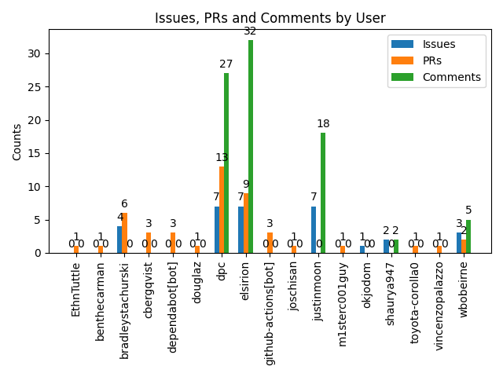

## Graphs

# Open Issues

| Number | Title | User | State | Created At | Updated At | Comments | Labels |
|--------|-------|------|-------|------------|------------|----------|--------|
| #1031 | [Look into using `anyhow` more intelligently and attaching context](https://github.com/fedimint/fedimint/issues/1031) | elsirion | open | 2022-12-01 22:09:53 | 2023-09-09 22:10:08 | 2 | rust |
| #3131 | [Integrate Gateway with LSP Spec](https://github.com/fedimint/fedimint/issues/3131) | justinmoon | open | 2023-09-08 17:33:02 | 2023-09-09 22:04:56 | 6 |  |
| #1298 | [Use `SafeUrl` all over the code](https://github.com/fedimint/fedimint/issues/1298) | dpc | open | 2023-01-12 19:08:11 | 2023-09-09 20:58:45 | 6 | good first issue |
| #3107 | [Intermittent `switch-gateway` failures](https://github.com/fedimint/fedimint/issues/3107) | bradleystachurski | open | 2023-09-05 20:57:36 | 2023-09-09 17:45:10 | 0 | lightning |
| #1978 | [Don't fork cln_plugin](https://github.com/fedimint/fedimint/issues/1978) | justinmoon | open | 2023-03-20 13:55:28 | 2023-09-08 14:06:37 | 2 | good first issue, dependencies, lightning |
| #3124 | [Guardian "meta" for arbitrary key / value data per guardian](https://github.com/fedimint/fedimint/issues/3124) | wbobeirne | open | 2023-09-07 16:00:25 | 2023-09-08 10:32:10 | 1 | ui, api |
| #3129 | [Prevent GH workflows on forks that access secrets](https://github.com/fedimint/fedimint/issues/3129) | bradleystachurski | open | 2023-09-08 03:55:27 | 2023-09-08 03:55:27 | 0 |  |
| #2815 | [Config API: Split `ReadyForConfigGen` to 2 states](https://github.com/fedimint/fedimint/issues/2815) | justinmoon | open | 2023-07-21 17:35:22 | 2023-09-07 16:19:28 | 1 |  |
| #2781 | [Config API: `run_dkg` method returns immediately](https://github.com/fedimint/fedimint/issues/2781) | justinmoon | open | 2023-07-18 22:04:26 | 2023-09-07 16:18:39 | 1 |  |
| #3120 | [Consolidate API endpoints between a module's client and server](https://github.com/fedimint/fedimint/issues/3120) | shaurya947 | open | 2023-09-06 21:20:39 | 2023-09-07 13:28:32 | 1 |  |
| #2791 | [Dynamic meta fields](https://github.com/fedimint/fedimint/issues/2791) | elsirion | open | 2023-07-20 07:48:48 | 2023-09-07 13:26:44 | 2 |  |
| #3119 | [Expose helpful info about available modules from CLI](https://github.com/fedimint/fedimint/issues/3119) | shaurya947 | open | 2023-09-06 20:29:04 | 2023-09-07 13:17:06 | 1 |  |
| #3121 | [Investigate running some tests on ios simulator / android emulator](https://github.com/fedimint/fedimint/issues/3121) | justinmoon | open | 2023-09-07 02:09:09 | 2023-09-07 02:09:09 | 0 |  |
| #3061 | [devimint docker container](https://github.com/fedimint/fedimint/issues/3061) | justinmoon | open | 2023-08-29 21:43:14 | 2023-09-06 18:25:35 | 5 |  |
| #3104 | [On the api_endpoint failure jsonrpc server does not send any response](https://github.com/fedimint/fedimint/issues/3104) | dpc | open | 2023-09-05 17:17:59 | 2023-09-06 16:23:41 | 5 |  |
| #3102 | [Code Coverage tests failures/hangs/slow?](https://github.com/fedimint/fedimint/issues/3102) | dpc | open | 2023-09-05 15:44:24 | 2023-09-06 08:21:54 | 1 |  |
| #2825 | [Intermittant CI failure tracking issue II](https://github.com/fedimint/fedimint/issues/2825) | elsirion | open | 2023-07-23 19:45:11 | 2023-09-05 10:32:01 | 22 | CI |
| #3099 | [`modules_json` returns wrong config type](https://github.com/fedimint/fedimint/issues/3099) | elsirion | open | 2023-09-05 08:12:49 | 2023-09-05 08:12:49 | 0 | api |

# Open Pull Requests

| Number | Title | User | State | Created At | Updated At | Comments | Labels |
|--------|-------|------|-------|------------|------------|----------|--------|
| #3132 | [chore: Update LDK deps](https://github.com/fedimint/fedimint/pull/3132) | benthecarman | open | 2023-09-09 00:22:03 | 2023-09-11 01:16:53 | 1 |  |
| #3133 | [feat: Use `SafeUrl` to avoid exposing passwords in logs & UI](https://github.com/fedimint/fedimint/pull/3133) | cbergqvist | open | 2023-09-09 09:13:25 | 2023-09-10 19:38:15 | 1 |  |
| #3135 | [fix: set gateway state to running prior to register clients timer](https://github.com/fedimint/fedimint/pull/3135) | bradleystachurski | open | 2023-09-09 17:48:58 | 2023-09-10 02:25:58 | 2 |  |
| #3130 | [chore: prevent gh workflows with secrets on forks](https://github.com/fedimint/fedimint/pull/3130) | bradleystachurski | open | 2023-09-08 04:09:15 | 2023-09-09 22:41:03 | 3 |  |
| #3134 | [refactor: use endpoints for outpoint outcomes instead of transactions](https://github.com/fedimint/fedimint/pull/3134) | joschisan | open | 2023-09-09 10:24:12 | 2023-09-09 15:43:47 | 1 |  |
| #3066 | [[WIP] chore: adding more logs and trying to remove flakiness](https://github.com/fedimint/fedimint/pull/3066) | douglaz | open | 2023-08-30 21:36:04 | 2023-09-08 20:45:05 | 1 |  |
| #3079 | [Expose JSON encoded client config](https://github.com/fedimint/fedimint/pull/3079) | elsirion | open | 2023-09-01 11:45:19 | 2023-09-08 19:20:20 | 2 |  |
| #3073 | [feat(nix): build and publish `fedimint-devtools` container](https://github.com/fedimint/fedimint/pull/3073) | dpc | open | 2023-08-31 19:53:42 | 2023-09-08 19:16:35 | 6 |  |
| #3123 | [chore(gateway): log error when config fetching failed](https://github.com/fedimint/fedimint/pull/3123) | elsirion | open | 2023-09-07 14:20:12 | 2023-09-08 12:41:50 | 1 |  |
| #2960 | [cln: update to v23.08 to allow self payments](https://github.com/fedimint/fedimint/pull/2960) | vincenzopalazzo | open | 2023-08-15 13:48:31 | 2023-09-08 10:42:22 | 10 |  |
| #3127 | [chore: devimint docs](https://github.com/fedimint/fedimint/pull/3127) | EthnTuttle | open | 2023-09-08 01:06:15 | 2023-09-08 01:25:28 | 1 |  |
| #3008 | [WIP: new backup/recovery API](https://github.com/fedimint/fedimint/pull/3008) | elsirion | open | 2023-08-22 14:59:14 | 2023-09-06 15:39:35 | 1 |  |
| #2899 | [chore(deps): bump bitcoincore-rpc from 0.16.0 to 0.17.0](https://github.com/fedimint/fedimint/pull/2899) | dependabot[bot] | open | 2023-08-03 17:16:23 | 2023-09-05 17:31:35 | 1 | dependencies, rust |

# Closed Issues

| Number | Title | User | State | Created At | Updated At | Comments | Labels |
|--------|-------|------|-------|------------|------------|----------|--------|
| #2993 | [wallet-client: handle timeout state](https://github.com/fedimint/fedimint/issues/2993) | elsirion | closed | 2023-08-18 16:57:01 | 2023-09-08 18:20:46 | 1 | bug, client, wallet |
| #3080 | [Remove `modules_json` from `ServerConfigConsensus`](https://github.com/fedimint/fedimint/issues/3080) | elsirion | closed | 2023-09-01 12:30:42 | 2023-09-08 18:09:35 | 4 |  |
| #1437 | [gateway-cli: Non informative error when making a typo in password](https://github.com/fedimint/fedimint/issues/1437) | dpc | closed | 2023-01-20 19:12:08 | 2023-09-08 16:33:49 | 6 | good first issue, lightning |
| #2605 | [Audit functionality extremely slow](https://github.com/fedimint/fedimint/issues/2605) | dpc | closed | 2023-05-31 03:09:11 | 2023-09-06 17:37:25 | 6 |  |
| #3113 | [Don't run `extra-docker-images` GH workflow on forks](https://github.com/fedimint/fedimint/issues/3113) | bradleystachurski | closed | 2023-09-06 09:34:17 | 2023-09-06 10:26:23 | 0 |  |
| #3076 | [Audit RPC should return default values for modules without transactions](https://github.com/fedimint/fedimint/issues/3076) | bradleystachurski | closed | 2023-08-31 21:28:22 | 2023-09-06 09:04:32 | 0 |  |
| #3071 | [Audit RPC endpoint should be instance-id aware](https://github.com/fedimint/fedimint/issues/3071) | justinmoon | closed | 2023-08-31 19:19:21 | 2023-09-06 09:04:32 | 3 |  |
| #3108 | [`VerifiableResponse` is not robust against random error](https://github.com/fedimint/fedimint/issues/3108) | dpc | closed | 2023-09-05 22:19:14 | 2023-09-05 23:53:15 | 1 |  |
| #3016 | [It's possible to trigger db commit conficts from the API](https://github.com/fedimint/fedimint/issues/3016) | dpc | closed | 2023-08-22 22:58:58 | 2023-09-05 20:33:11 | 2 |  |
| #2857 | [Gateway: Boot even when a previously known client fails to (re)initialize](https://github.com/fedimint/fedimint/issues/2857) | okjodom | closed | 2023-07-28 21:19:03 | 2023-09-05 14:49:09 | 0 | good first issue, lightning |
| #3089 | [Provide more federation info to gateway from `/info` endpoint](https://github.com/fedimint/fedimint/issues/3089) | wbobeirne | closed | 2023-09-01 21:14:38 | 2023-09-05 10:38:38 | 0 | lightning, api |
| #3100 | [Remove `ServerConfigConsensus::modules_json`](https://github.com/fedimint/fedimint/issues/3100) | elsirion | closed | 2023-09-05 08:18:52 | 2023-09-05 08:57:14 | 1 | refactor |
| #3069 | [RPC to get current bitcoin block height from wallet module](https://github.com/fedimint/fedimint/issues/3069) | wbobeirne | closed | 2023-08-30 23:33:17 | 2023-09-04 23:13:18 | 4 |  |

# Closed Pull Requests

| Number | Title | User | State | Created At | Updated At | Comments | Labels |
|--------|-------|------|-------|------------|------------|----------|--------|
| #3117 | [fix(wallet-client): timeout can only occur *after* `Created` state](https://github.com/fedimint/fedimint/pull/3117) | elsirion | closed | 2023-09-06 17:01:30 | 2023-09-08 18:20:46 | 1 |  |
| #3126 | [feat: pass extra dkg meta to fedimintd](https://github.com/fedimint/fedimint/pull/3126) | dpc | closed | 2023-09-07 22:06:51 | 2023-09-08 16:52:17 | 1 |  |
| #3128 | [fix: add missing migration test for `BlockCountVote`](https://github.com/fedimint/fedimint/pull/3128) | bradleystachurski | closed | 2023-09-08 03:09:50 | 2023-09-08 13:04:36 | 1 |  |
| #3125 | [[Backport releases/v0.1] fix(client): reintroduce module commands](https://github.com/fedimint/fedimint/pull/3125) | github-actions[bot] | closed | 2023-09-07 22:01:12 | 2023-09-08 10:53:46 | 1 |  |
| #3114 | [Prevent `extra-docker-images` GH workflow on forks](https://github.com/fedimint/fedimint/pull/3114) | bradleystachurski | closed | 2023-09-06 09:41:47 | 2023-09-08 04:01:25 | 1 |  |
| #3118 | [fix(client): reintroduce module commands](https://github.com/fedimint/fedimint/pull/3118) | elsirion | closed | 2023-09-06 19:33:01 | 2023-09-07 22:01:13 | 3 | backport releases/v0.1 |
| #3070 | [Add LightningAuditItemKeys and db compaction](https://github.com/fedimint/fedimint/pull/3070) | bradleystachurski | closed | 2023-08-31 14:50:08 | 2023-09-07 21:39:03 | 6 |  |
| #3122 | [chore: disable incremental builds in ci build profile](https://github.com/fedimint/fedimint/pull/3122) | dpc | closed | 2023-09-07 02:25:18 | 2023-09-07 15:41:52 | 1 |  |
| #3053 | [chore: set consensus version on master to `u32::MAX`](https://github.com/fedimint/fedimint/pull/3053) | elsirion | closed | 2023-08-29 16:15:38 | 2023-09-07 15:41:52 | 2 |  |
| #3054 | [chore: set consensus version to 1](https://github.com/fedimint/fedimint/pull/3054) | elsirion | closed | 2023-08-29 16:16:16 | 2023-09-07 13:27:09 | 3 |  |
| #3116 | [fix: don't execute state transitions for outdated states](https://github.com/fedimint/fedimint/pull/3116) | elsirion | closed | 2023-09-06 16:19:21 | 2023-09-06 16:47:13 | 0 |  |
| #3112 | [[Backport releases/v0.1] fix: db commit failures on `/config` endpoint](https://github.com/fedimint/fedimint/pull/3112) | github-actions[bot] | closed | 2023-09-06 08:48:48 | 2023-09-06 16:25:48 | 1 |  |
| #3106 | [fix: missing commit_tx call ](https://github.com/fedimint/fedimint/pull/3106) | dpc | closed | 2023-09-05 20:21:15 | 2023-09-06 15:58:21 | 3 |  |
| #3111 | [ fix: warning about uncommited writes ](https://github.com/fedimint/fedimint/pull/3111) | dpc | closed | 2023-09-05 23:16:02 | 2023-09-06 15:45:12 | 1 |  |
| #3096 | [chore(deps): bump cachix/install-nix-action from 22 to 23](https://github.com/fedimint/fedimint/pull/3096) | dependabot[bot] | closed | 2023-09-04 17:15:16 | 2023-09-06 12:13:45 | 1 | dependencies, github_actions |
| #3110 | [chore: use explicit targets for client requests](https://github.com/fedimint/fedimint/pull/3110) | dpc | closed | 2023-09-05 23:13:03 | 2023-09-06 10:46:22 | 1 |  |
| #3109 | [fix: `Vec<u8>` serde serialization for Raw dyn values](https://github.com/fedimint/fedimint/pull/3109) | dpc | closed | 2023-09-05 23:11:39 | 2023-09-06 10:25:15 | 3 |  |
| #3115 | [Abort database transaction in `submit_transaction`](https://github.com/fedimint/fedimint/pull/3115) | elsirion | closed | 2023-09-06 09:57:37 | 2023-09-06 09:59:37 | 1 |  |
| #3090 | [Refactor Audit RPC (module instance IDs and defaults)](https://github.com/fedimint/fedimint/pull/3090) | bradleystachurski | closed | 2023-09-01 21:20:32 | 2023-09-06 09:07:43 | 5 |  |
| #3105 | [fix: db commit failures on `/config` endpoint](https://github.com/fedimint/fedimint/pull/3105) | dpc | closed | 2023-09-05 19:51:54 | 2023-09-06 08:48:49 | 3 | backport releases/v0.1 |
| #3101 | [feat: Switch to vanilla cln-plugin instead of custom fork](https://github.com/fedimint/fedimint/pull/3101) | cbergqvist | closed | 2023-09-05 12:19:09 | 2023-09-05 17:59:42 | 3 |  |
| #3093 | [chore: put a timeout on an api request for config](https://github.com/fedimint/fedimint/pull/3093) | dpc | closed | 2023-09-01 21:42:07 | 2023-09-05 17:27:05 | 2 |  |
| #3103 | [[Backport releases/v0.1] feature(gateway): add ClientConfig to FederationInfo for /info api endpoint](https://github.com/fedimint/fedimint/pull/3103) | wbobeirne | closed | 2023-09-05 15:49:07 | 2023-09-05 17:24:21 | 0 |  |
| #3082 | [fix: boot when a client fails to initialize](https://github.com/fedimint/fedimint/pull/3082) | m1sterc001guy | closed | 2023-09-01 16:54:20 | 2023-09-05 14:49:09 | 0 |  |
| #3098 | [small mispelling fix](https://github.com/fedimint/fedimint/pull/3098) | toyota-corolla0 | closed | 2023-09-05 03:44:45 | 2023-09-05 12:49:51 | 1 |  |
| #3092 | [chore: improvements after debugging API request crash](https://github.com/fedimint/fedimint/pull/3092) | dpc | closed | 2023-09-01 21:38:54 | 2023-09-05 12:49:51 | 1 |  |
| #3081 | [feat(cli): Add command for outputting config](https://github.com/fedimint/fedimint/pull/3081) | cbergqvist | closed | 2023-09-01 15:32:37 | 2023-09-05 11:10:34 | 4 |  |
| #3091 | [ chore(devimint): speed up fed initialization ](https://github.com/fedimint/fedimint/pull/3091) | dpc | closed | 2023-09-01 21:36:36 | 2023-09-05 10:44:15 | 0 |  |
| #3094 | [feature(gateway): add ClientConfig to FederationInfo for /info api endpoint](https://github.com/fedimint/fedimint/pull/3094) | wbobeirne | closed | 2023-09-01 21:46:16 | 2023-09-05 10:39:07 | 2 | backport releases/v0.1 |
| #3097 | [chore(deps): bump actions/checkout from 3 to 4](https://github.com/fedimint/fedimint/pull/3097) | dependabot[bot] | closed | 2023-09-04 17:15:20 | 2023-09-05 10:35:56 | 1 | dependencies, github_actions |
| #3062 | [chore: guard against mistakes causing rebuilds in CI tests](https://github.com/fedimint/fedimint/pull/3062) | dpc | closed | 2023-08-30 01:41:38 | 2023-09-05 03:41:12 | 1 |  |
| #3083 | [feat(module/wallet): add `block_count_local` api](https://github.com/fedimint/fedimint/pull/3083) | dpc | closed | 2023-09-01 17:52:06 | 2023-09-04 23:13:17 | 3 |  |
| #3088 | [[Backport releases/v0.1] Start externals with `devimint run-ui`](https://github.com/fedimint/fedimint/pull/3088) | github-actions[bot] | closed | 2023-09-01 20:40:05 | 2023-09-04 12:58:37 | 1 |  |
